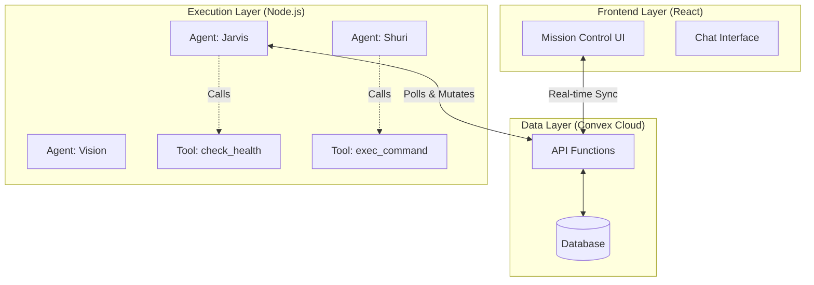
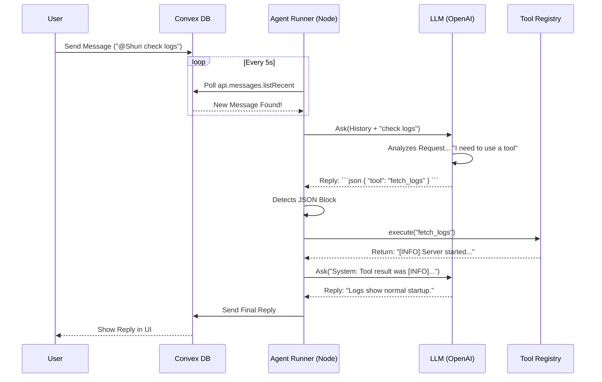

# Architecture & Solution Design

**Mission Control** is an **Agentic Orchestration Platform**. It allows human users to collaborate with semi-autonomous AI agents that have access to real-world tools.

## 1. System Overview (The Hybrid Model)
The system is split into two physical domains:
1.  **The Cloud (Convex)**: The "Shared Memory" and synchronization layer. It holds the state of the world (Tasks, Chat, Agent Status).
2.  **The Edge (Local Runners)**: The "Bodies" of the agents. These are Node.js processes running on your local machine (or Docker) that actually execute commands.

---

## 2. The Agent Loop (Solution Design)

The core innovation is the **Poll-Think-Act Loop** running inside `scripts/agent-runner.ts`.

### Sequence Diagram: Handling a User Request
When you type *"@Shuri check logs"* in the War Room, this happens:

---

## 3. Component Deep Dive

### A. The Convex Backend (The Cortex)
Acts as the central message bus.
- **`messages` Table**: Stores the chat history. All agents watch this.
- **`tasks` Table**: Stores executable missions. Implement **Atomic locking** (`claim` mutation) to ensure two agents don't grab the same ticket.

### B. The Agent Runner (`scripts/agent-runner.ts`)
The standard "Body" for all agents.
- **Identity**: Reads `SOUL.md` at startup to determine *who* it is (Jarvis vs Shuri).
- **Heartbeat**: Pings `api.agents.heartbeat` every 30s so the UI knows it's online.
- **Brain Integration**: Interacts with `scripts/openclaw_brain.ts`.

### C. The Brain (`scripts/openclaw_brain.ts`)
A wrapper around OpenAI GPT-4.
- **System Prompt**: Injects the Agent's Name, Role, and **Tool Definitions**.
- **JSON Mode**: Instructs the LLM to output strictly formatted JSON if it wants to perform an action.

### D. The Tool Registry (`scripts/tools.ts`)
A modular system for capabilities.
- **Registry Pattern**: Maps string names (`"check_server"`) to async Javascript functions.
- **Safety**: The LLM *cannot* run arbitrary code. It can only call functions explicitly registered here.

---

## 4. Security & Scaling
- **API Keys**: Stored in local `.env`. The Runner reads them directly; they are never sent to the browser or Convex.
- **Scale**: You can run 50+ agents. Each is just a lightweight Node process. The Convex backend handles the concurrency.
