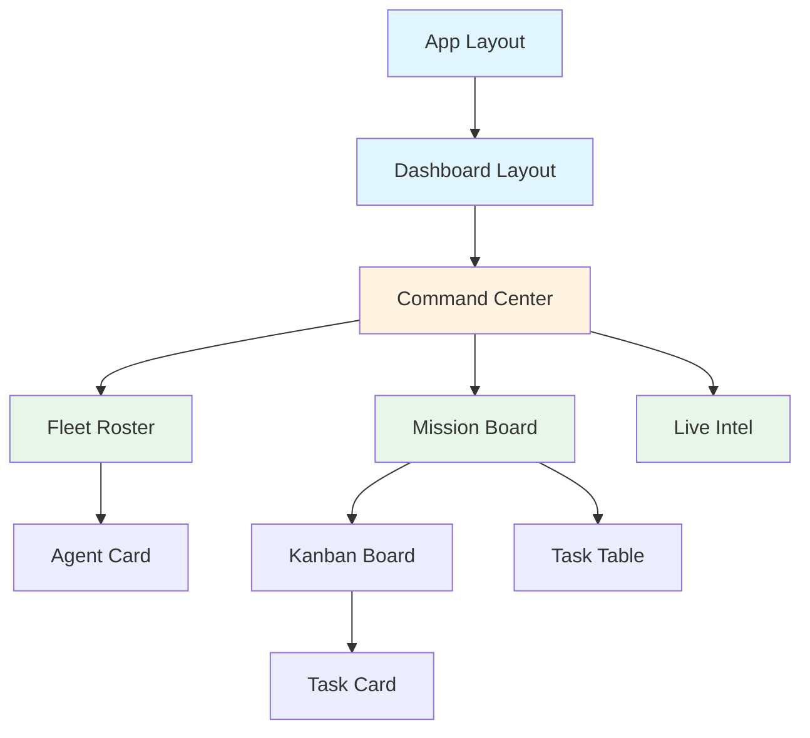
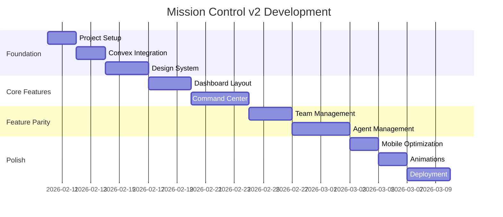

# Mission Control v2 - Modern UI Implementation Plan

## Executive Summary

This plan outlines the migration of the Mission Control Dashboard from React (Vite) to Next.js 16 with a modern UI stack, while retaining the proven Convex backend and agent infrastructure. The approach uses **parallel development** to minimize risk and enable gradual migration.

**Timeline:** 4 weeks  
**Approach:** New directory (`mission-control-v2/`)  
**Risk Level:** Low (parallel development, no backend changes)  
**Expected Outcome:** Production-ready modern UI with 50%+ performance improvement

---

## Problem Statement

### Current Limitations
1. **Performance:** Vanilla React lacks built-in optimizations (SSR, code splitting)
2. **Developer Experience:** Manual routing, state management complexity
3. **Styling:** Inline styles and CSS modules are harder to maintain
4. **Mobile:** Not optimized for responsive/mobile experience
5. **Scalability:** Growing component complexity without proper architecture

### Opportunity
- Leverage modern frameworks (Next.js 16, Tailwind v4)
- Implement production-ready animations (Framer Motion)
- Use accessible component primitives (shadcn/ui)
- Improve developer velocity and code maintainability

---

## Proposed Solution

### Tech Stack

#### Frontend Framework
**Next.js 16 (App Router)**
- ✅ Built-in routing with layouts
- ✅ Server components for better performance
- ✅ Automatic code splitting
- ✅ Image optimization
- ✅ Better SEO (if needed for marketing)
- ✅ Industry standard (easier hiring)

#### Styling
**Tailwind CSS v4**
- ✅ Utility-first approach
- ✅ Faster build times (Rust-based engine)
- ✅ Better IntelliSense
- ✅ Consistent design system
- ✅ Responsive design built-in

#### UI Components
**shadcn/ui**
- ✅ Copy-paste components (not a dependency)
- ✅ Built on Radix UI (accessible)
- ✅ Fully customizable
- ✅ TypeScript-first
- ✅ Active community

#### Animation
**Framer Motion**
- ✅ Production-ready animations
- ✅ Gesture support (drag-and-drop)
- ✅ Layout animations
- ✅ Excellent performance
- ✅ Declarative API

#### State Management
**Convex (Keep Existing)**
- ✅ Real-time updates
- ✅ TypeScript-first
- ✅ Built-in auth
- ✅ Proven reliability
- ✅ No migration needed

#### Additional Libraries
- **Lucide React** - Icon library (keep existing)
- **Recharts/Tremor** - Analytics dashboards
- **Sonner** - Toast notifications
- **Vaul** - Drawer component
- **cmdk** - Command palette

---

## Architecture Design

### Directory Structure

```
openclaw-fleet-manager/
├── convex/                    # ✅ KEEP - Backend (no changes)
├── agents/                    # ✅ KEEP - Agent configs
├── scripts/                   # ✅ KEEP - Universal runner
├── docs/                      # ✅ KEEP - Documentation
├── mission-control-dashboard/ # 🔒 ARCHIVE - Current UI (v1)
└── mission-control-v2/        # 🆕 NEW - Modern UI
    ├── app/
    │   ├── (dashboard)/
    │   │   ├── layout.tsx          # Dashboard shell
    │   │   ├── page.tsx            # Command Center
    │   │   ├── teams/
    │   │   │   └── [id]/page.tsx   # Team view
    │   │   └── agents/
    │   │       └── [id]/page.tsx   # Agent detail
    │   ├── layout.tsx              # Root layout
    │   ├── globals.css
    │   └── providers.tsx           # Convex + Theme
    ├── components/
    │   ├── ui/                     # shadcn components
    │   ├── dashboard/
    │   │   ├── command-center.tsx
    │   │   ├── fleet-roster.tsx
    │   │   └── mission-board.tsx
    │   ├── agents/
    │   │   ├── agent-card.tsx
    │   │   └── agent-modal.tsx
    │   └── missions/
    │       ├── kanban-board.tsx
    │       └── task-card.tsx
    ├── lib/
    │   ├── convex.ts              # Convex client
    │   ├── utils.ts               # Helpers
    │   └── hooks/                 # Custom hooks
    ├── public/
    ├── convex.config.ts           # Points to same project
    ├── tailwind.config.ts
    ├── next.config.ts
    └── package.json
```

### Component Architecture



---

## Proposed Changes

### Phase 1: Foundation (Week 1)

#### Setup & Configuration
**New Files:**
- [NEW] [mission-control-v2/](file:///Users/amrendra/Om/MyWorkspace/MyProjects/openclaw-fleet-manager/mission-control-v2/) - Next.js project root
- [NEW] [app/layout.tsx](file:///Users/amrendra/Om/MyWorkspace/MyProjects/openclaw-fleet-manager/mission-control-v2/app/layout.tsx) - Root layout with providers
- [NEW] [app/globals.css](file:///Users/amrendra/Om/MyWorkspace/MyProjects/openclaw-fleet-manager/mission-control-v2/app/globals.css) - Tailwind + custom styles
- [NEW] [lib/convex.ts](file:///Users/amrendra/Om/MyWorkspace/MyProjects/openclaw-fleet-manager/mission-control-v2/lib/convex.ts) - Convex client setup
- [NEW] [components/ui/](file:///Users/amrendra/Om/MyWorkspace/MyProjects/openclaw-fleet-manager/mission-control-v2/components/ui/) - shadcn components

**Tasks:**
1. Initialize Next.js 16 project with TypeScript
2. Install dependencies (Tailwind v4, Framer Motion, shadcn/ui)
3. Configure Convex integration (same deployment)
4. Set up theme system (dark/light mode)
5. Create design tokens (colors, spacing, typography)
6. Install shadcn components (button, card, dialog, etc.)

**Deliverable:** Working Next.js app connected to Convex

---

### Phase 2: Core Components (Week 2)

#### Dashboard Layout
**New Files:**
- [NEW] [app/(dashboard)/layout.tsx](file:///Users/amrendra/Om/MyWorkspace/MyProjects/openclaw-fleet-manager/mission-control-v2/app/(dashboard)/layout.tsx) - Dashboard shell
- [NEW] [components/dashboard/sidebar.tsx](file:///Users/amrendra/Om/MyWorkspace/MyProjects/openclaw-fleet-manager/mission-control-v2/components/dashboard/sidebar.tsx) - Collapsible sidebar
- [NEW] [components/dashboard/header.tsx](file:///Users/amrendra/Om/MyWorkspace/MyProjects/openclaw-fleet-manager/mission-control-v2/components/dashboard/header.tsx) - Top navigation

**Tasks:**
1. Build responsive sidebar with shadcn Sheet
2. Implement theme toggle
3. Create navigation structure
4. Add command palette (⌘K)

#### Command Center Page
**New Files:**
- [NEW] [app/(dashboard)/page.tsx](file:///Users/amrendra/Om/MyWorkspace/MyProjects/openclaw-fleet-manager/mission-control-v2/app/(dashboard)/page.tsx) - Command Center
- [NEW] [components/dashboard/command-center.tsx](file:///Users/amrendra/Om/MyWorkspace/MyProjects/openclaw-fleet-manager/mission-control-v2/components/dashboard/command-center.tsx) - 3-pane layout
- [NEW] [components/dashboard/fleet-roster.tsx](file:///Users/amrendra/Om/MyWorkspace/MyProjects/openclaw-fleet-manager/mission-control-v2/components/dashboard/fleet-roster.tsx) - Agent list
- [NEW] [components/dashboard/mission-board.tsx](file:///Users/amrendra/Om/MyWorkspace/MyProjects/openclaw-fleet-manager/mission-control-v2/components/dashboard/mission-board.tsx) - Kanban/Table

**Tasks:**
1. Implement 3-pane layout with Framer Motion
2. Build Fleet Roster with role badges
3. Create Kanban board with drag-and-drop
4. Add Live Intel activity feed
5. Implement collapsible panels

**Deliverable:** Functional Command Center page

---

### Phase 3: Feature Parity (Week 3)

#### Team Management
**New Files:**
- [NEW] [app/(dashboard)/teams/[id]/page.tsx](file:///Users/amrendra/Om/MyWorkspace/MyProjects/openclaw-fleet-manager/mission-control-v2/app/(dashboard)/teams/[id]/page.tsx) - Team view
- [NEW] [components/teams/team-sidebar.tsx](file:///Users/amrendra/Om/MyWorkspace/MyProjects/openclaw-fleet-manager/mission-control-v2/components/teams/team-sidebar.tsx) - Team agent list
- [NEW] [components/teams/team-board.tsx](file:///Users/amrendra/Om/MyWorkspace/MyProjects/openclaw-fleet-manager/mission-control-v2/components/teams/team-board.tsx) - Team missions

**Tasks:**
1. Build team detail pages
2. Implement agent hiring flow
3. Create mission creation modal
4. Add team settings

#### Agent Management
**New Files:**
- [NEW] [app/(dashboard)/agents/[id]/page.tsx](file:///Users/amrendra/Om/MyWorkspace/MyProjects/openclaw-fleet-manager/mission-control-v2/app/(dashboard)/agents/[id]/page.tsx) - Agent detail
- [NEW] [components/agents/agent-config.tsx](file:///Users/amrendra/Om/MyWorkspace/MyProjects/openclaw-fleet-manager/mission-control-v2/components/agents/agent-config.tsx) - Configuration UI
- [NEW] [components/agents/agent-activity.tsx](file:///Users/amrendra/Om/MyWorkspace/MyProjects/openclaw-fleet-manager/mission-control-v2/components/agents/agent-activity.tsx) - Activity log

**Tasks:**
1. Build agent detail pages
2. Implement configuration editor
3. Add activity timeline
4. Create performance metrics

**Deliverable:** Complete feature parity with v1

---

### Phase 4: Polish & Deploy (Week 4)

#### Mobile Optimization
**Tasks:**
1. Implement responsive breakpoints
2. Add touch gestures for Kanban
3. Create mobile navigation drawer
4. Optimize for small screens

#### Animations & Micro-interactions
**Tasks:**
1. Add page transitions
2. Implement skeleton loaders
3. Create hover effects
4. Add toast notifications

#### Performance Optimization
**Tasks:**
1. Optimize images with Next.js Image
2. Implement code splitting
3. Add loading states
4. Optimize bundle size

#### Deployment
**Tasks:**
1. Set up Vercel deployment
2. Configure environment variables
3. Test production build
4. Create deployment documentation

**Deliverable:** Production-ready v2 UI

---

## Migration Strategy

### Parallel Development Approach

#### Week 1-4: Build v2
```bash
# Both UIs run simultaneously
v1: http://localhost:5176  (Current React UI)
v2: http://localhost:3000  (New Next.js UI)

# Both connect to same Convex backend
Convex: Same deployment URL
```

#### Week 5: Soft Launch
- Deploy v2 to staging subdomain: `v2.mission-control.com`
- Internal team testing
- Gather feedback
- Fix bugs

#### Week 6: Production Rollout
**Option A: Gradual (Recommended)**
```
Week 6: 10% of users → v2
Week 7: 50% of users → v2
Week 8: 100% of users → v2
```

**Option B: Feature Flag**
```typescript
// Allow users to toggle
const useV2 = localStorage.getItem('useNewUI') === 'true';
```

**Option C: Hard Cutover**
- Switch all users to v2 at once
- Keep v1 as fallback for 2 weeks

---

## Risk Assessment

### Technical Risks

| Risk | Impact | Probability | Mitigation |
|------|--------|-------------|------------|
| Convex integration issues | High | Low | Test early, use same config |
| Performance regression | Medium | Low | Benchmark before/after |
| Missing features | Medium | Medium | Feature parity checklist |
| Browser compatibility | Low | Low | Test on major browsers |
| Mobile issues | Medium | Medium | Test on real devices |

### Business Risks

| Risk | Impact | Probability | Mitigation |
|------|--------|-------------|------------|
| User confusion | Medium | Medium | Gradual rollout, documentation |
| Development delays | Medium | Medium | Buffer time in schedule |
| Team learning curve | Low | Medium | Pair programming, docs |
| Dual maintenance cost | Low | High | Time-box v1 support |

---

## Success Metrics

### Performance
- [ ] Initial page load < 2s (vs current ~4s)
- [ ] Time to interactive < 3s
- [ ] Lighthouse score > 90
- [ ] Bundle size < 500KB (gzipped)

### User Experience
- [ ] Mobile responsive (all breakpoints)
- [ ] Accessibility score > 95 (WCAG AA)
- [ ] 60fps animations
- [ ] < 100ms interaction response

### Developer Experience
- [ ] Build time < 30s
- [ ] Hot reload < 1s
- [ ] TypeScript coverage > 95%
- [ ] Component reusability > 80%

### Business
- [ ] Feature parity with v1
- [ ] Zero downtime deployment
- [ ] < 5% user complaints
- [ ] Team velocity +30%

---

## Timeline & Milestones



### Key Dates
- **Feb 10:** Project kickoff
- **Feb 17:** Foundation complete
- **Feb 24:** Core features complete
- **Mar 3:** Feature parity achieved
- **Mar 10:** Production deployment

---

## Resource Requirements

### Development Team
- **1 Frontend Developer** (full-time, 4 weeks)
- **0.5 Designer** (part-time, design system)
- **0.25 DevOps** (deployment setup)

### Tools & Services
- **Vercel** - Hosting (free tier sufficient)
- **Convex** - Backend (existing)
- **GitHub** - Version control (existing)
- **Figma** - Design mockups (optional)

### Budget Estimate
- Development time: 4 weeks × $X/week
- Tools: $0 (using free tiers)
- **Total:** Primarily time investment

---

## Rollback Plan

### If v2 Has Critical Issues

**Immediate (< 1 hour):**
1. Switch DNS/routing back to v1
2. Notify users via status page
3. Gather error logs

**Short-term (1-7 days):**
1. Fix critical bugs in v2
2. Deploy fixes to staging
3. Re-test thoroughly

**Long-term (> 7 days):**
1. Keep v1 running for 2 weeks minimum
2. Maintain both codebases during transition
3. Sunset v1 only after v2 is stable

---

## Next Steps

### Immediate Actions (This Week)
1. [ ] Get stakeholder approval on this plan
2. [ ] Set up `mission-control-v2/` directory
3. [ ] Initialize Next.js 16 project
4. [ ] Configure Convex integration
5. [ ] Install core dependencies

### Week 1 Goals
1. [ ] Working Next.js app
2. [ ] Convex connected (same backend)
3. [ ] Theme system functional
4. [ ] shadcn components installed
5. [ ] Basic layout structure

### Decision Points
- **End of Week 1:** Continue or pivot based on POC
- **End of Week 2:** Assess if timeline is realistic
- **End of Week 3:** Go/no-go for production deployment

---

## Appendix

### Comparison: Current vs Proposed

| Aspect | Current (v1) | Proposed (v2) |
|--------|-------------|---------------|
| Framework | React + Vite | Next.js 16 |
| Styling | CSS Modules | Tailwind v4 |
| Components | Custom | shadcn/ui |
| Animation | CSS | Framer Motion |
| Routing | React Router | Next.js App Router |
| State | React Context | Convex (same) |
| Build Time | ~15s | ~10s |
| Bundle Size | ~800KB | ~400KB (est.) |
| Mobile | Partial | Full support |
| SEO | Limited | Built-in |

### Key Dependencies

```json
{
  "dependencies": {
    "next": "^16.1.6",
    "react": "^19.2.3",
    "convex": "^1.x",
    "framer-motion": "^12.x",
    "lucide-react": "^0.x",
    "tailwindcss": "^4.x",
    "recharts": "^3.x",
    "sonner": "^1.x",
    "cmdk": "^1.x"
  }
}
```

### References
- [Next.js 16 Docs](https://nextjs.org/docs)
- [Tailwind v4 Docs](https://tailwindcss.com/docs)
- [shadcn/ui](https://ui.shadcn.com)
- [Framer Motion](https://www.framer.com/motion)
- [Convex Docs](https://docs.convex.dev)

---

**Document Version:** 1.0  
**Last Updated:** February 7, 2026  
**Author:** Mission Control Team  
**Status:** Awaiting Approval
